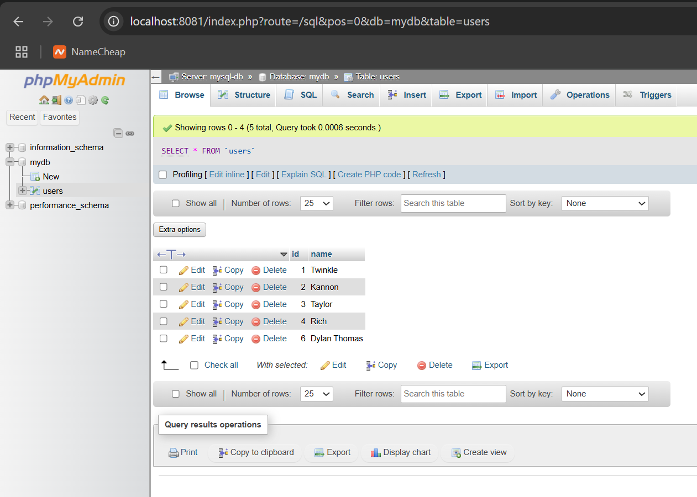
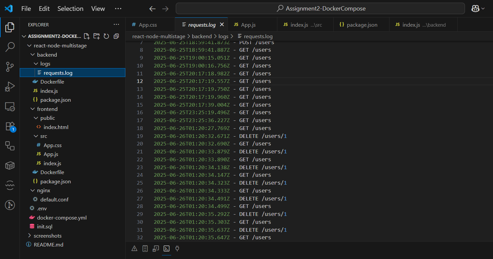
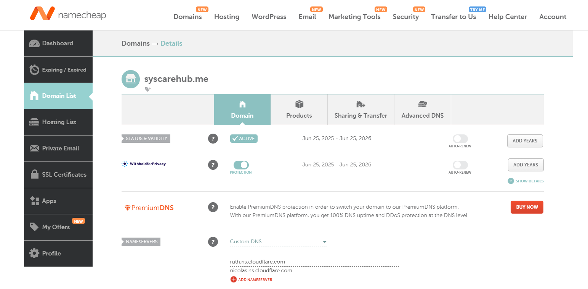
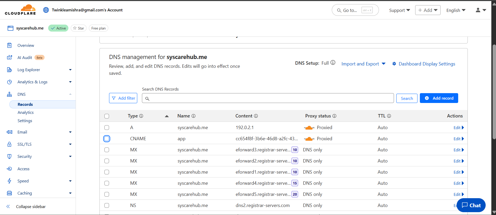
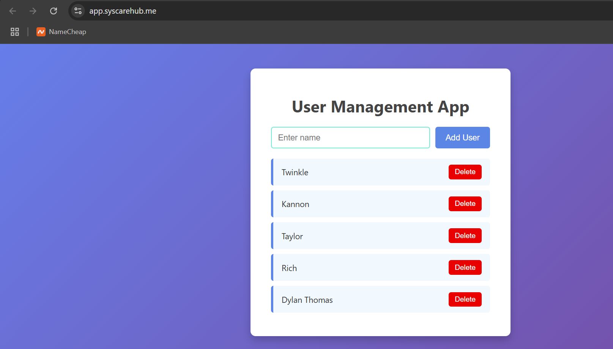
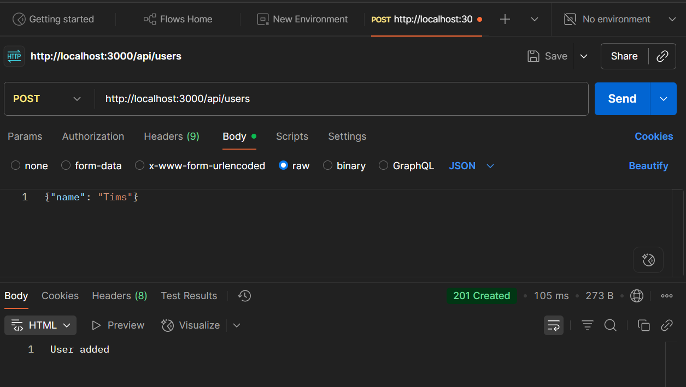
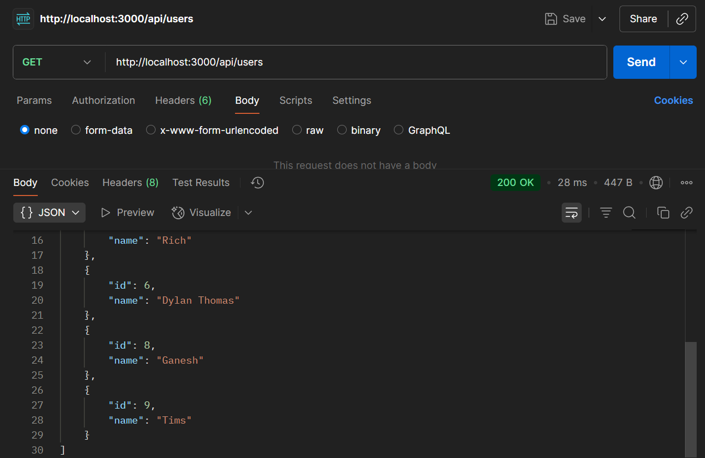
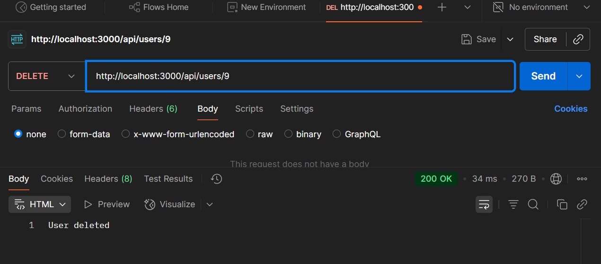

# Dockerized User Management App with Cloudflare Tunnel

## Project Overview

This project demonstrates a scalable, secure, and containerized user management web application using Docker and Docker Compose. It features:

- A Node.js + Express backend API
- React frontend (multi-stage Docker build)
- MySQL database for persistence
- NGINX as a reverse proxy/load balancer
- Docker Volumes and Networks
- Cloudflare Tunnel for external access

---

## Technologies Used

- **Node.js + Express**: Backend API server
- **ReactJS**: Frontend (Multi-stage build)
- **MySQL**: Relational database
- **NGINX**: Load balancer
- **Docker & Docker Compose**: Container orchestration
- **Cloudflare Tunnel**: Secure external access

---

## Folder Structure

```
.
├── backend/
│   ├── index.js         # Express backend logic
│   ├── package.json
│   ├── logs/            # Logs requests to requests.log
│   └── Dockerfile
│
├── frontend/
│   ├── src/             # React components
│   ├── public/
│   ├── package.json
│   └── Dockerfile       # Multi-stage build
│
├── nginx/
│   └── default.conf     # Reverse proxy config
│
├── .env                 # Stores node env
├── init.sql             # Initializes MySQL schema
├── docker-compose.yml   # Defines and orchestrates services
├── screenshots/         # Folder with screenshots
└── README.md
```

---

##  How to Run the Project

### Prerequisites

Make sure you have installed:

- Docker
- Cloudflare

---

### Clone the Repository

```bash
git clone https://github.com/TwinkleM97/A2-Advance-Containers.git
cd A2-Advance-Containers
```

---

### Start All Containers

```bash
docker-compose up --build
```

🔹 This builds and starts:

- React frontend (on port 80)
- Node backend (on port 3000)
- MySQL database with volume
- NGINX load balancer (routes frontend/backend)

---

### Test API via curl

####  Add a user

```bash
curl -X POST http://localhost:3000/api/users -H "Content-Type: application/json" -d '{"name": "Tims"}'
```

#### Get all users

```bash
curl http://localhost:3000/api/users
```

#### Delete a user by ID

```bash
curl -X DELETE http://localhost:3000/api/users/1
```

All requests are logged in `backend/logs/requests.log`

---

## Configuration Breakdown

###  `docker-compose.yml`

Defines services:

- **frontend**: React build served by NGINX
- **backend**: Express API
- **mysql**: MySQL 8 with `init.sql`
- **nginx**: Reverse proxy with load balancing

### Backend Dockerfile (multi-stage)

```Dockerfile
# Stage 1 - Builder
FROM node:18-alpine as build
WORKDIR /app
COPY package*.json ./
RUN npm install
COPY . .
RUN npm run build

# Stage 2 - Serve with NGINX
FROM nginx:alpine
COPY --from=build /app/build /usr/share/nginx/html
```

### NGINX Config

Routes requests:

- `/api/*` → backend
- `/` → frontend Load balances between backend replicas

### Load Balancing with NGINX

NGINX is configured as a load balancer to distribute API traffic across three backend containers: `backend`, `backend-2`, and `backend-3`.

- The `nginx/default.conf` defines an `upstream` block:

```nginx
upstream backend_cluster {
    server backend:3000;
    server backend-2:3000;
    server backend-3:3000;
}
```
- Requests to /api/ are forwarded using:

```nginx
location /api/ {
    proxy_pass http://backend_cluster;
}
```
- This configuration distributes incoming requests evenly across backend containers, enhancing both performance and fault tolerance.

### MySQL Setup

Uses `init.sql` to create `users` table automatically on first run.
- user: 'myuser',
- password: 'myuserpass'

### Logging

Every API call is logged to `backend/logs/requests.log`:

```log
2025-06-25T19:00:16.756Z - GET /users
```

---

## Security Best Practices

- Backend runs as **non-root** user
- Minimal images (slim, multi-stage)
- MySQL uses **volume** for persistence

---

## Cloudflare Tunnel

### Steps Followed:

1. **Logged into Cloudflare**:

```bash
cloudflared login
```

2. **Listed Tunnels (to check existing)**:

```bash
cloudflared tunnel list
```

3. **Created Tunnel** (if not already created):

```bash
cloudflared tunnel create myapp
```

4. **Created Config File**: Path: `C:\Users\twink\.cloudflared\config.yml`

```yml
tunnel: cc654f8f-3b6e-46d8-a2fc-43022106e8b5
credentials-file: C:\Users\twink\.cloudflared\cc654f8f-3b6e-46d8-a2fc-43022106e8b5.json

ingress:
  - hostname: app.syscarehub.me
    service: http://localhost:3000
  - service: http_status:404
```

5. **Started Tunnel using Config**:

```bash
cloudflared tunnel --config "C:\Users\twink\.cloudflared\config.yml" run myapp
```

6. App now accessible at: `https://app.syscarehub.me`

---

## Screenshots 

- CLI: docker ps output


- Docker Desktop shows containers running


- React Frontend working in browser


- Backend API container running


- phpMyAdmin shows user table


- API logs captured in backend


- Namecheap Domain Configuration


- Cloudflared login (browser auth)


- List of tunnels created via Cloudflare


- Cloudflared tunnel run command 


- Cloudflare DNS Records Configuration


- Live application working via https://app.syscarehub.me


### API Testing via curl

- POST /api/users



- GET /api/users



- DELETE /api/users/9



---

## Summary

This project showcases a fully Dockerized user management app with:

- A secure, multi-container setup using Docker Compose

- React + Node.js + MySQL stack with persistent volumes

- NGINX reverse proxy with load balancing

- Cloudflare Tunnel for secure external access

- API request logging and container security best practices
---

## Author

**Twinkle Akhilesh Mishra - 8894858**